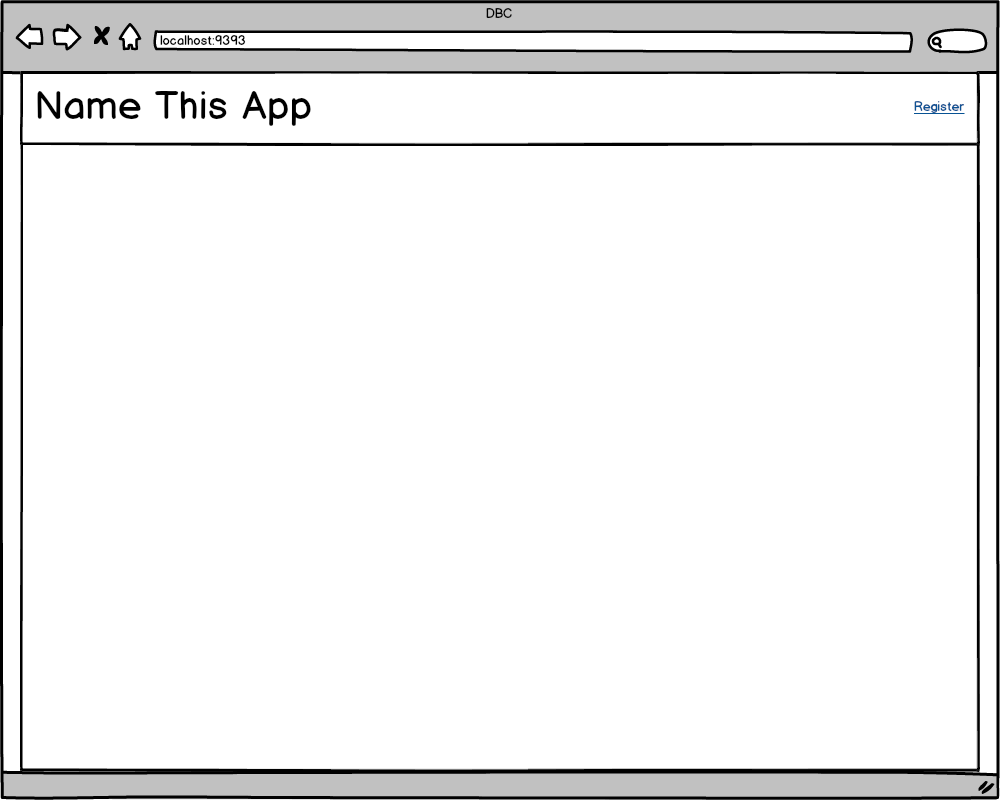
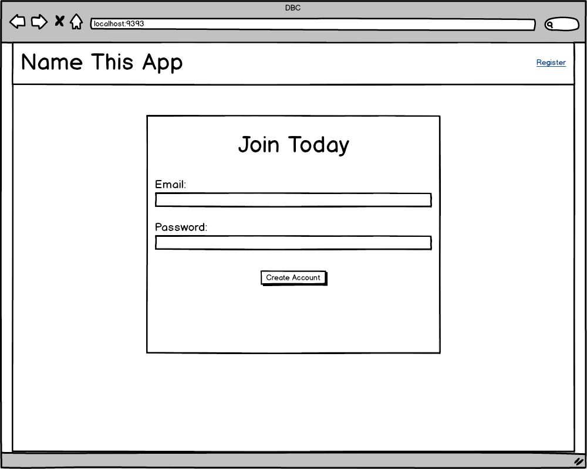
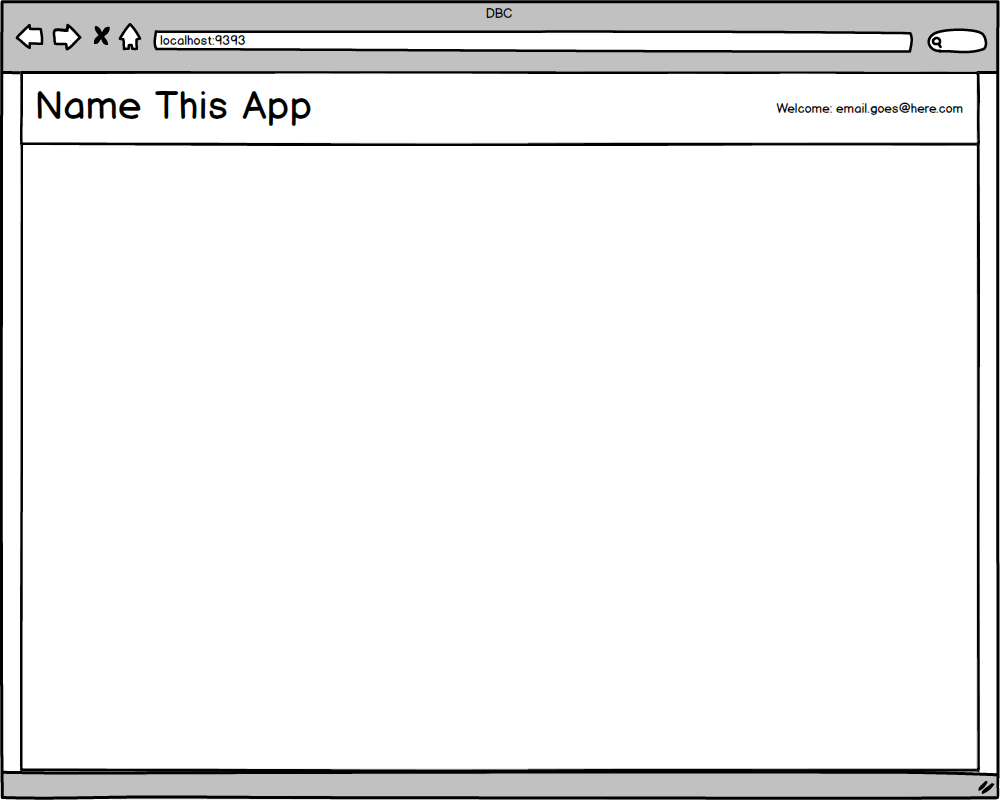
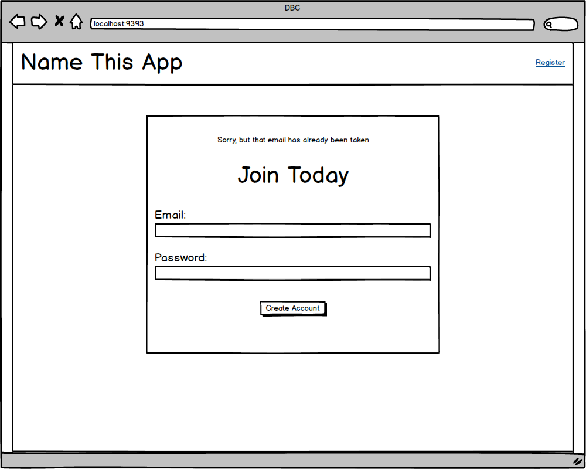
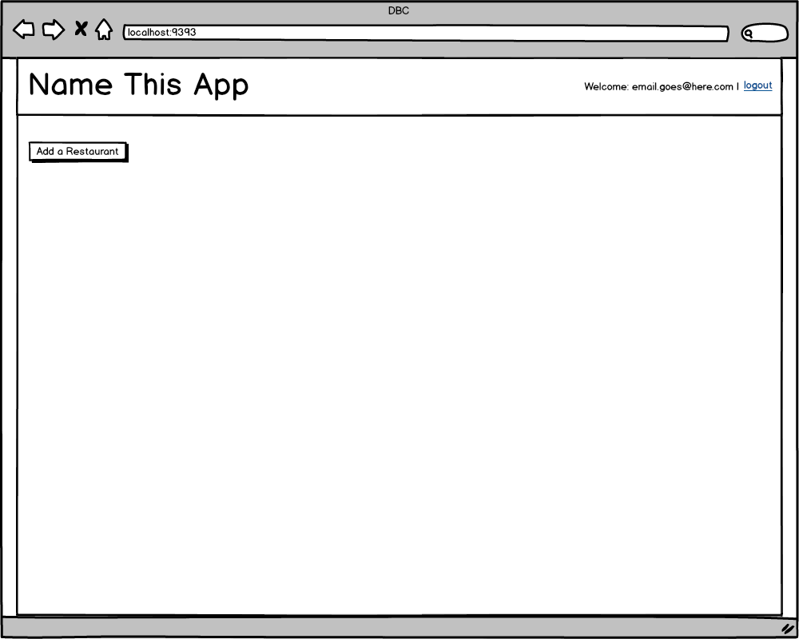
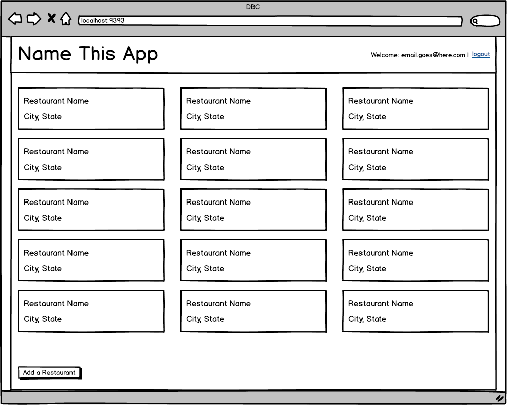
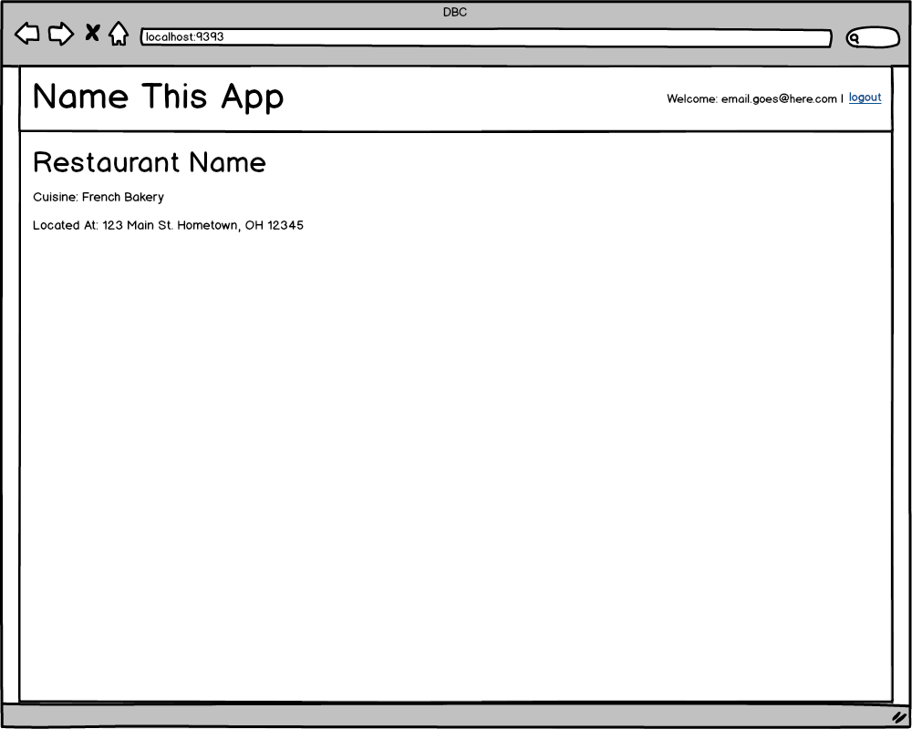
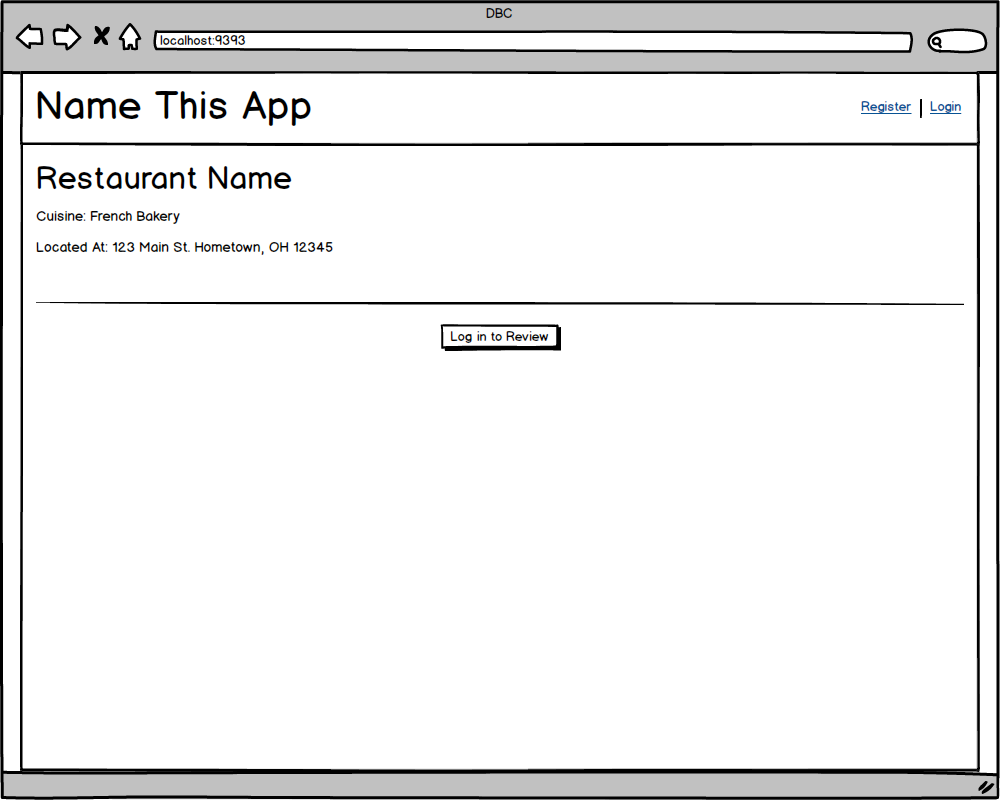
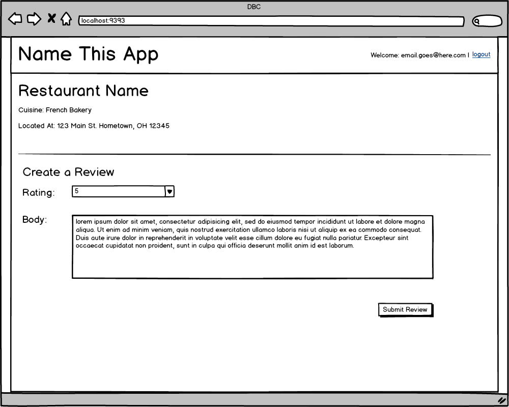

# Part 3: Build a CRUD App

## Summary

In Part 3 of the assessment, we will demonstrate our proficiency in building
web-stack applications: user authentication, associations, validations,
controllers, views, etc. Even a little bit of CSS.

### Site Overview

In this section, we will build a simplified version of Yelp. We will not worry
about locations or ways of categorizing listings, but instead focus solely on
creating restaurants and allowing users to review them.

The required functionality of the site will be described in more detail in the
*Releases* section, but here's a basic overview.

#### All Users
- Browse available restaurants

#### Unregistered Users
- Register a new account

#### Registered Users
- Sign in
- Sign out
- Create new restaurants
- Review a restaurant

### Completing the App
Complete as much of this CRUD app as possible in the time allowed.  If time is
running out and it looks like the app will not be completed, continue to work
through the releases in order and complete as much as possible. Be sure to ask
questions, if you find yourself stuck.

## Releases
### Pre-release:  Setup

We'll need to make sure that everything is set up before we begin working on
the application.  From the command line, navigate to the `part-3` directory of
the phase 2 assessment.  Once there, run ...

0. `$ bundle`
0. `$ bundle exec rake db:create`

_NOTE:_ In the mockups below the URLs are omitted. You should determine the
appropriate path(s) based on conventions / patterns you have learned about in
Phase 2.

### Release 0: User Registration
_Given:_
* The current user does not have an account.

---------

Create a "Register" link on the homepage.

When the user clicks the "Register" link they should be taken to a page with a form to create a new account (email, password)
  * Emails must be unique

Upon successful submission:
  * the user record should be created
  * the user should be logged in
  * the user should be taken back to the homepage

When returning to the home page:
  * the "Register" link should no longer be visible
  * the user should see "Welcome: [email]"

Upon unsuccessful submission:
  * the user should be returned to the registration page
  * the user should see an error message "Sorry, but that email has already been taken."

### Release 1: Login/Logout
#### Login
_Given:_

* There is a previously registered user
* User is not currently logged in:

-------

On the home page, create a link to login next to the registration link.

When a user clicks on this link they should be taken to a page with a form to
enter their credentials.

If the credentials match, the user should be taken back to the homepage.

If the credentials do not match, the user should see the login form and an error message stating the credentials were not valid.

#### Logout
_Given:_

* There is a previously registered user
* User is currently logged in

--------

Create a "logout" link on the homepage.

When the user clicks on the logout link they should be taken to the home page and the links "Register" and "Login" should both be visible.

### Release 2: CRUD'ing a Resource
We'll now give users the ability to add new restaurants to the site.

#### Creating Restuarants
_Given:_

* The registered user is signed in:

--------

On the home page create a link to add a restaurant, this link should only be visible to signed in users.

When the user clicks on the add restaurant link they should be taken to a page where they can enter the following information:
  * name
  * cuisine (e.g., American Pub, French Bakery, etc.)
  * address
  * city
  * state
  * zip

When the user submits the form
  * the user should be set as the restaurant's creator
  * the user should be taken back to the home page

#### Reading Restuarants
_Given:_
* There exist previously created restaurants

-------

Display all the restaurants

#### Updating Restaurants
_Given:_
* The registered user is signed in
* The registered user has previously created restaurants

---------

Add a link to edit restaurants created by the user

When the user clicks the edit link, they should be taken to a page to edit the information for the restaurant

When the user submits the form
  * the user should be taken back to the home page
  * the restaurant's information should be updated

#### Deleting Restaurants
_Given_
* The registered user is signed in
* The registered user has previously created restaurants

---------

Add a button to delete a restaurant to each restaurant the user created

When the user clicks the delete button
  * the restaurant record should be removed from the data store
  * the user should be taken back to the home page
  * the restaurant should no longer appear on the page

### Release 3: Review
Knowing that all these restaurants exist is a great start, now let's provide a way for users to add a review.

#### Restaurant Page
_Given_
* There exist previously created restaurants

--------

Update the restaurant listings on the home page by making the name a link

When the user clicks on the restaurant name they should be taken to a page with all the details for the restaurant.

#### Creating a Review
_Given_
* The user is _not_ logged in
* The user is on a restaurant detail page

------
Add a button to the page requiring log in to review

When the user clicks this button they should be taken to the same page as the login instructions above

_Given_
* The registered user is signed in
* The user is on a restaurant detail page

-----

Show a form allowing the user to
  * rate a restaurant (1 - 5)
  * provide a body for the review

When the user submits the form
  * the user should be returned to the restaurant page
  * the user should no longer see the form
  * the user should see a thank you message
  * the thank you message will only be visible when being redirected to the restaurant details page after creating a review

#### Viewing Restaurant Reviews
_Given_
* The user is on a restaurant detail page

-----

Show all the reviews for a restaurant
  * Only Show the review form if the user has not created a review.

_User reviewed restaurant_

_User has not reviewed restaurant_

## Conclusion
Part-3 wraps up the assessment.  If you haven't already done so, commit your
changes.  Please wait until the end of the assessment period to submit your
solution.
